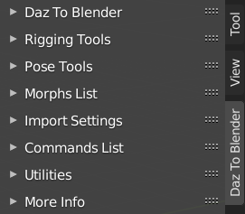
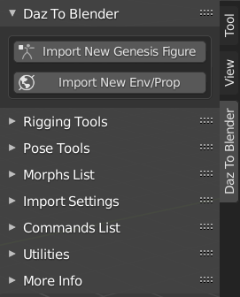
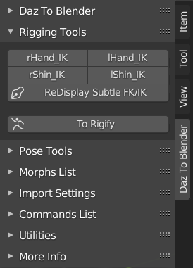
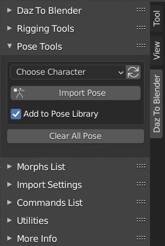
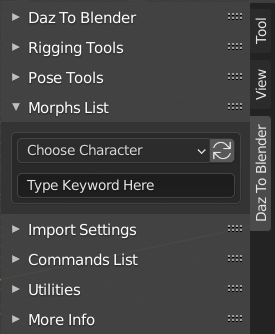
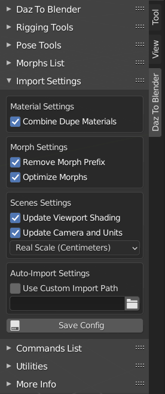
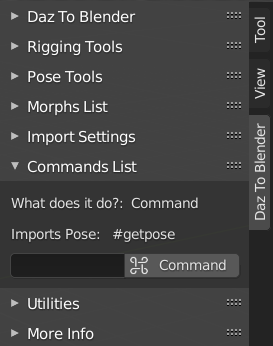
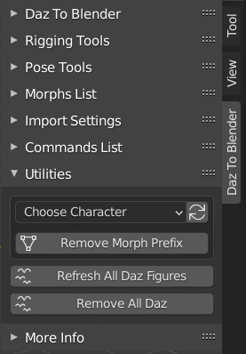
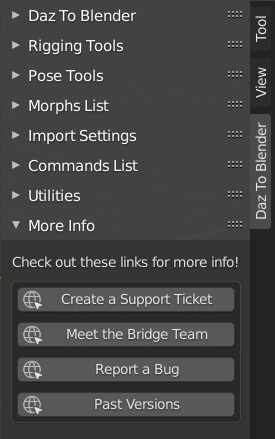

# Blender Plugin UI Breakdown
---

Here we will do a quick overview of everything you'll see in the UI in Blender.

&nbsp;

&nbsp;

&nbsp;

&nbsp;

&nbsp;

## Daz To Blender
---

 This section is what you'll be using the most. This is where you will go to bring your exports into Blender.

&nbsp;

1. **Import New Genesis Figure**
   
   Imports the latest figure you have exported from Daz Studio.

2. **Import New Env/Prop**
   
   Imports the latest environment or prop you have exported from Daz Studio.

   
&nbsp;

   
&nbsp;

## Rigging Tools
---

Here you will find tools to display hidden IK controls and adapt the Daz skeleton to work with Rigify

*(These dropdown options will only appear if you've imported a rigged model into blender.)*

&nbsp;

1. **rHand_Ik**
   
   Displays the right hand IK control for use in posing.

2. **lHand_Ik**
   
   Displays the left hand IK control for use in posing.

3. **rShin_Ik**
   
   Displays the right shin IK control for use in posing.

4. **lShin_Ik**
   
   Displays the left shin IK control for use in posing.

5. **ReDisplay Subtle FK/IK**
   
   This simply recalculates the display of FK and IK handles incase of lost or confusing visual information.

6. **To Rigify**
   
   Converts the Daz skeleton to work with Rigify.

   *(This feature is still in active development and may not work exactly as expected.)*

## Pose Tools
---

Here you can import pose presets saved in your Daz library.

&nbsp;

1. **Choose Character**
   
   The dropdown will let you choose between your currently imported poses in the pose library.

2. **Import Pose**
   
   This is where you will naviagte to the pose you wish to import and bring it into blender.

3. **Add to Pose Library**
   
   Toggling on and off will decide whether or not to add a pose to your library on import.

4. **Clear All Pose**
   
   Resets the current character pose to default.

## Morphs List
---

This where any imported morphs will be stored for each character.

&nbsp;

1. **Choose Character**
   
   The dropdown will list all the current characters in the scene and their morphs.

&nbsp;

&nbsp;

&nbsp;

&nbsp;

## Import Settings
---

define indivual options when importing from Daz Studio and define where your imports or being stored.

&nbsp;

1. **Combine Dupe Materials**
   
   When importing multiple assets with duplicate materials, decides if the duplicates should be auto deleted and retargeted or not. 

1. **Remove Morph Prefix**
   
  Whether or not to remove asset names from imported shapekeys.

1. **Optimize Morphs**
   
   This toggle will dictate whether or not to auto delete unnecessary morphs on child objects.

1. **Update Viewport Shading**
   
   Whether or not blender switchs to viewport shading on import. 

1. **Update Camera and Units**
   
   Toggle to decide the scale units and camera location on import.

   *(The dropdown will give you options to define a new scale value.)* 

2. **Use Custom Import Path**
   
   Define where your Daz to Blender imports are stored on the disk space. 

## Commands List
---

*(The Commands List is a deprecated feature and will be removed or restructured.)*

&nbsp;

&nbsp;

&nbsp;

&nbsp;

&nbsp;

&nbsp;

&nbsp;

&nbsp;

## Utilities
---

Extra workflow tools. 

&nbsp;

1. **Remove Morph Prefix**
   
   Manually run the remove morph prefix option from import settings.

2. **Refresh All Daz Figures**
   
   Repopulates the list of Daz characters in the dropdown.

3. **Remove All Daz**
   
   Deletes all Daz content except the root from the Blender scene collection.

   
&nbsp;

## More Info
---

This section contains useful links to additional tools and docuements.

&nbsp;

1. **Create a Support Ticket**
   
   This link will take you to the Daz Zendesk where you can fill out a ticket if you need help from our customer service team.

2. **Meet the Bridge Team**

    This takes you to a forum page on Daz.com where you can find out a little about the people working on the bridge.
   
3. **Report a Bug**
   
   A direct link to our DaztoBlender github Issues page where you can ask us any of the more technical questions you might have regarding bugs and any unexpected behaviour with the bridge.

4. **Past Versions**

    This will direct you to the archive of previous versions of the bridge.